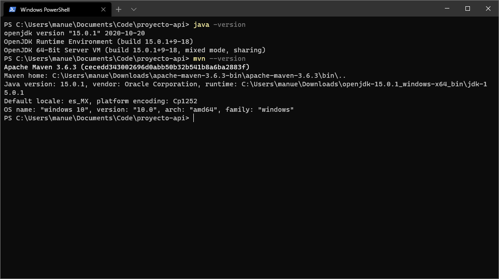

# Base de Datos. Unidad 5 actividad complementaria 2
### 1) Instalación de Java y Maven
En Windows 10 deberás instalar Java 15 y Maven

Java

https://download.java.net/java/GA/jdk15.0.1/51f4f36ad4ef43e39d0dfdbaf6549e32/9/GPL/openjdk-15.0.1_windows-x64_bin.zip

Maven

https://downloads.apache.org/maven/maven-3/3.6.3/binaries/apache-maven-3.6.3-bin.zip

Deberás descomprimir cada archivo en una ubicación de tu elección y crear 
las variables de ambiente JAVA_HOME y MAVEN_HOME como se muestra en estas imágenes.
Las rutas deberán ser modificadas a tu entorno.


Se deberá modificar la variable path y agregar las rutas %JAVA_HOME%/bin y %MAVEN_HOME%/bin


Para comprobar que se ha realizado correctamente la instalación, en una consola de PowerShell o Terminal,
teclear
```
java -version
```
y
```
mvn --version
```

La salida de cada comando deberá ser similar a la siguiente imagen


### 2) Descarga del proyecto

Deberás descarga el proyecto en zip de https://github.com/tiempor3al/proyecto-api, y descomprimirlo  en la ubicación de tu elección.


  
### 3) Modificación de las credenciales de la base de datos

Para que el proyecto se conecte a la base de datos que tienen instalada en su equipo, deberán modificar el archivo application.properties 
que se encuentra en /src/main/resources con los datos correspondientes a su base de datos:

```
quarkus.datasource.username = fca
quarkus.datasource.password = fca01
quarkus.datasource.jdbc.url = jdbc:mysql://192.168.1.112:33700/fca
```

Para la url, la sintaxis es
```
jdbc:mysql://<dirección_ip>:<puerto>/<nombre_de_la_base>
```
Por ejemplo para conectarse a la base de datos "prueba" en localhost, la sintáxis 
de la url será:
```
jdbc:mysql://localhost:3306/prueba
```
Nota: el puerto 3306 es el estándar para MariaDB / MySQL


### 4) Compilación del proyecto

En PowerShell o Terminal, navegar al directorio donde se descargó el proyecto y ejecutar el comando:

```
./mvnw.cmd quarkus:dev
```

Este comando descargará las librerías requeridas para el proyecto, y ejecutará la aplicación Web en modo "desarrollo" en el puerto 8090.


El modo "desarrollo" habilita la opción "hot reload". Es decir, se pueden modificar los archivos y se recompilaran mientras se ejecuta la aplicación.

5) Actividades
a) Ejecutar la aplicación y navegar a http://localhost:8090 en el navegador de tu elección.


b) Navegar al explorador de Swagger integrado, con http://localhost:8090/docs


